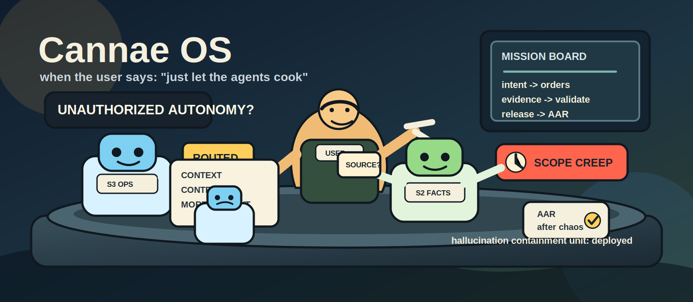
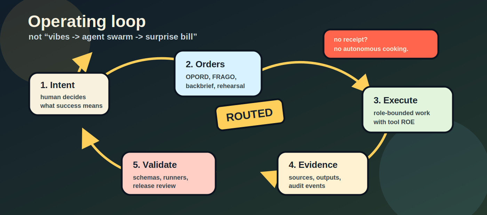
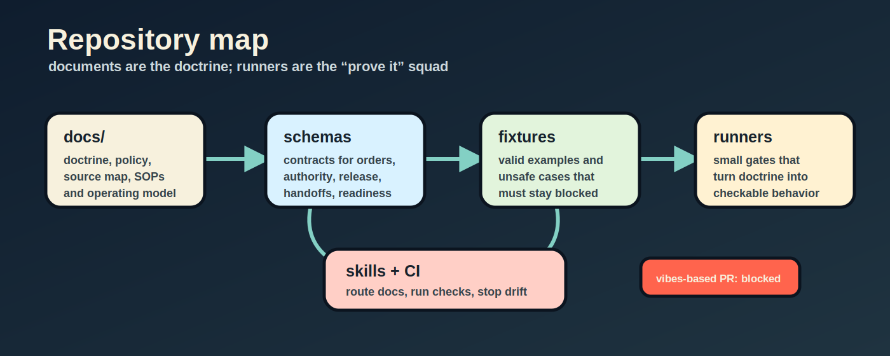
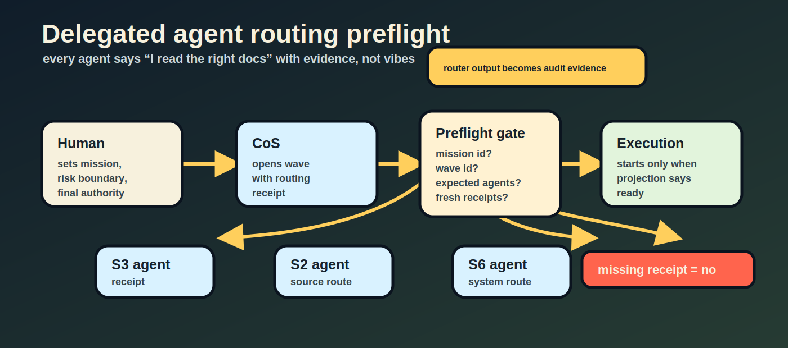
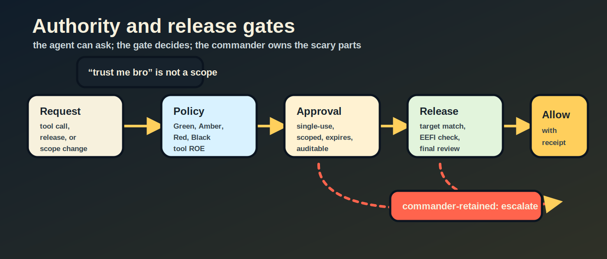
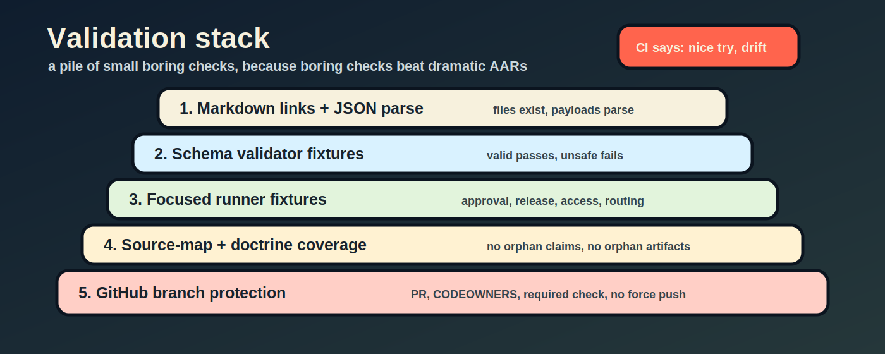

# Cannae OS

[](LICENSE-APACHE)
[](LICENSE-MIT)
[](#current-maturity)
[](#quick-start)

<p align="center">
  
</p>

Military-inspired command, control, and validation doctrine for operating LLM agents.

Cannae OS is a documentation-first framework for using LLMs and multi-agent systems with clearer intent, bounded authority, auditable handoffs, source discipline, and executable validation gates. It translates useful military operating patterns into AI work: commander's intent, OPORDs, FRAGOs, staff roles, CCIR, backbriefs, rehearsals, readiness checks, release review, and after-action learning.

The project is not a military operations manual. It is an operating model for complex knowledge work with AI agents.

## Origin

Autonomous AI work and AI transformation are becoming urgent topics. As more teams ask LLMs to perform work with less direct supervision, the central problem becomes harder: how do we preserve context, suppress hallucination, prevent authority drift, and still let AI execute useful work?

This project started from a conversation with a friend in the military. While discussing that problem, he said: "Isn't that exactly the military?"

That landed immediately.

Military organizations bring many different people into one system where intent can move from the highest decision-maker down to actual execution without being casually distorted. Along the way, subordinate units adapt the plan to their scale, function, and operating conditions, then issue more specific orders downward.

That is possible because military systems are built around explicit authority, bounded autonomy, role classification, reporting lines, standard documents, rehearsals, backbriefs, and after-action correction. The system is designed to conserve resources and win under uncertainty.

Cannae OS began from a simple question: is this the missing operating system for human-led AI teams?

## Why This Exists

Most LLM workflows fail in predictable ways:

- the user's intent gets diluted as work is delegated;
- agents read too much context, too little context, or the wrong context;
- authority boundaries are implicit;
- high-risk actions are approved too broadly;
- generated work is not tied to evidence;
- handoffs depend on chat memory instead of durable state;
- teams add more agents without clear roles, readiness, or sunset rules.

Cannae OS treats LLM work as a command-and-control problem:

```text
intent -> orders -> role-bounded execution -> evidence -> validation -> release -> AAR
```

<p align="center">
  
</p>

The goal is not to make agents more autonomous by default. The goal is to make delegated autonomy explicit, narrow, inspectable, and reversible where possible.

## Project Direction

Cannae OS is moving toward a practical runtime discipline for AI teams:

1. Doctrine: shared concepts, vocabulary, and operating principles.
2. Structured documents: OPORD, WARNO, FRAGO, SITREP, AAR, backbrief, rehearsal, approval, risk, release, and handoff contracts.
3. Runtime schemas: JSON contracts that make orders, authority, release, evidence, and readiness machine-checkable.
4. Policy gates: local runners that block known unsafe or under-specified states.
5. Skill routing: Codex and Claude Code skills that route huge documentation sets by user mode, role, department, authority, and need-to-know.
6. Bounded adaptation: campaign/checkpoint/decision contracts that let agents improve active work without self-authorizing scope, policy, or release.
7. Future runtime: a tool-gated orchestrator with approval UI, evidence store, event replay, dashboards, and cryptographically verifiable learning evidence.

The current repository is strongest as a doctrine, schema, fixture, and prototype suite. It is not yet a complete production agent runtime.

<p align="center">
  
</p>

## What Is In This Repository

### Doctrine And Operating Model

- [Military LLM Framework](docs/military-llm-framework-v0.1.md): the core command, authority, reporting, and AAR model.
- [Military Operating System](docs/military-operating-system.md): the layered operating system view of doctrine, SOP, intent, planning, orders, risk, liaison, assessment, and learning.
- [Agent Roles and Authority](docs/agent-roles-and-authority.md): role responsibilities, approval scope, reporting scope, autonomous action, and post-action controls.
- [Commander Handbook](docs/commander-handbook.md): how a human final decision-maker should issue intent, approve work, and manage risk.
- [Functional Domains](docs/functional-domains.md): mapping military functional domains to AI work functions.

### Orders, Handoffs, And Execution Control

- [Prompt Templates](docs/prompt-templates.md): OPORD, WARNO, FRAGO, SITREP, and AAR prompt structures.
- [Orders Production Pipeline](docs/orders-production-pipeline.md): request -> mission analysis -> OPORD -> task order -> backbrief -> rehearsal -> execution -> AAR.
- [Backbrief and Rehearsal SOP](docs/backbrief-and-rehearsal-sop.md): confirmation steps that reduce instruction distortion before execution.
- [OPORD Annex Model](docs/opord-annex-model.md): separation between command intent and specialist annexes.
- [Personnel Continuity Model](docs/personnel-continuity-model.md): succession, rotation, degraded mode, handoff, and vital records.

### Multi-Agent Organization

- [LLM Agent Org Chart](docs/llm-agent-org-chart.md): command relationships, staff functions, RACI, and reporting lines.
- [Agent Battle Rhythm](docs/agent-battle-rhythm.md): recurring status, decision, approval, and synchronization cadence.
- [Interdepartment Collaboration Policy](docs/interdepartment-collaboration-policy.md): supported/supporting relationships, liaison, handoff, and conflict routing.
- [B2C2WG Operating Model](docs/b2c2wg-operating-model.md): boards, bureaus, centers, cells, and working groups for multi-agent work.
- [AI Special Operations TF](docs/ai-special-operations-tf.md): high-risk or high-uncertainty task force activation with independent review, enablers, and abort criteria.
- [Force Structure Change Policy](docs/force-structure-change-policy.md): when to create, expand, reduce, merge, deactivate, or disband roles, units, and task forces.
- [Model Force Assignment Policy](docs/model-force-assignment-policy.md): mission-based allocation of deterministic, line, specialist, command, SOF, assurance, and reserve model capacity.
- [Model Force v0.2 Operations](docs/model-force-v0.2-operations.md): registry-to-compiler-to-routing-preflight procedure for dispatching heterogeneous agent forces.
- [Bounded Self-Improvement Operations](docs/bounded-self-improvement-operations.md): evidence-driven improvement of active work and control-plane candidates with finite budgets, rollback, escalation, and human release authority.

### Authority, Risk, Release, And Security

- [Tool Use ROE](docs/tool-use-roe.md): Green, Amber, Red, and Black tool-use boundaries.
- [Approval Scope Policy](docs/approval-scope-policy.md): single-use approvals, expiry, rollback, evidence, renewal, revocation, and delegation.
- [Risk Acceptance Authority](docs/risk-acceptance-authority.md): residual risk acceptance and commander-retained authority.
- [Context Releasability Policy](docs/context-releasability-policy.md): role-based context release and final-output controls.
- [OPSEC Classification Model](docs/opsec-classification-model.md): EEFI, classification, releasability, and sensitive-output handling.
- [Role Document Access Policy](docs/role-document-access-policy.md): document access by role, duty, authority, classification, and need-to-know.

### Research And Source Discipline

- [Source Map](docs/source-map.md): traceability between military doctrine sources and local framework artifacts.
- [Research Compendium](docs/research-compendium.md): research notes, interpretations, and open research gaps.
- [Source Reliability Rubric](docs/source-reliability-rubric.md): source quality, interpretation risk, and evidence handling.
- [Multinational Doctrine Consistency Review](docs/multinational-doctrine-consistency-review.md): checks against US-only assumptions and terminology drift.
- [Korean Military Sources](docs/korean-military-sources.md) and [Korean Org Culture](docs/korean-org-culture.md): localization notes and cultural adaptation.

### Runtime Contracts And Prototypes

- [Schema Files](schema-files/README.md): JSON Schema contracts for missions, orders, authority, approvals, risk, release, readiness, handoffs, routing receipts, and more.
- [Sample Payloads](sample-payloads/README.md): valid and invalid payloads for validator fixtures.
- [Validator CLI Prototype](validator-cli-prototype/README.md): dependency-free local schema and semantic validation.
- [Policy Engine Prototype](policy-engine-prototype/README.md): local policy decisions for tool requests.
- [Reference Architecture](docs/reference-architecture.md): orchestrator, policy engine, tool gateway, evidence store, event log, and dashboard architecture.
- [Runtime Automation Roadmap](docs/runtime-automation-roadmap.md): path from manual doctrine docs to a tool-gated runtime.
- [Model Force v0.2 Fixtures](model-force-v0.2-fixtures/README.md): integrated registry, compilation, routing receipt, dispatch, and telemetry examples.

### Agent Skills

- [Controls Doctrine Operator Skill](codex-skills/controls-doctrine-operator/SKILL.md): Codex skill for routing this corpus by task, role, department, authority, and validation surface.
- [Claude Code Controls Doctrine Operator Skill](.claude/skills/controls-doctrine-operator/SKILL.md): equivalent Claude Code project skill.
- [AI CLI Skill Installer](install-ai-cli-skills.sh): installs the Codex and Claude Code skill entries.

## Core Concepts

### Human Final Decision Authority

When a human user invokes the framework directly, the human remains the final decision-maker. The AI can brief, recommend, draft, validate, and warn. It should not restrict the user's view of the repository just because an AI role would have limited access.

### Delegated AI Operator

When an AI is acting as a role, department, staff section, or task force, it must operate within a declared boundary:

- role;
- department;
- authority scope;
- task;
- release target;
- risk level;
- need-to-know.

Delegated AI work should be routed through the Controls Doctrine Operator skill before execution.

<p align="center">
  
</p>

### Routing Receipts

The repository includes a routing receipt contract and preflight gate. A delegated wave should not start only because an agent says it routed its documents. It should produce a machine-checkable receipt.

Example:

```bash
node codex-skills/controls-doctrine-operator/scripts/route_controls_docs.js \
  --receipt \
  --scope=agent \
  --mission=MIS-example \
  --wave=W2 \
  --agent=plans-agent \
  --actor=ai \
  --role=S3 \
  --department=operations \
  --authority=scoped-execution \
  "plans-agent W2 execution planning" .
```

Preflight:

```bash
node agent-routing-preflight-runner.js agent-routing-preflight-fixtures/valid-wave-routing-bundle.json
```

### Heterogeneous Model Dispatch

Model selection is a separate control from agent routing and authority. Define an immutable registry snapshot and mission billet request, compile only eligible profiles, then bind current-wave receipts and billets through the integrated preflight:

```bash
node model-assignment-compiler.js \
  sample-payloads/valid-model-registry.json \
  sample-payloads/valid-model-assignment-request.json

node integrated-mission-preflight-runner.js \
  sample-payloads/valid-integrated-mission-preflight.json
```

Only a `ready` integrated projection emits dispatch rows. The model profile never inherits approval, risk acceptance, or release authority from its capability band.

### Repository-Isolated Artifacts

For multi-repository campaigns, durable AI outputs are stored under a stable repository identity instead of a shared flat output directory:

```text
.cannae/artifacts/repositories/<repository-key>/missions/<mission>/<wave>/<kind>/
```

Use `repository-artifact-store.js`, or pass `--write-artifact --repository <target>` to the model compiler and integrated preflight. Routing receipts use `--write-artifact --target-repository <target>`. See [Repository Artifact Isolation Policy](docs/repository-artifact-isolation-policy.md).

### Bounded Self-Improvement

Substantial AI missions can maintain a finite improvement campaign around work already in progress:

```text
campaign -> finite cycle order -> candidate -> executed receipt -> signed quorum -> decision -> next finite cycle order
```

`verification-runner.js` executes exact argument arrays without a shell and persists repository-state-bound receipts. A v0.3 campaign additionally requires fresh Ed25519 DSSE attestations from distinct trusted keys and policy-defined independence groups. `autonomous-improvement-controller.js` reloads the receipt, signatures, exact trust policy, accepted parent decision, and any consumed approval event from the integrity-checked repository artifact store before promotion. `campaign-supervisor.js` then reconstructs the complete campaign chain from the verified manifest and emits only the next finite `start`, `retry`, `advance`, or `before_completion` order. Incomplete lineage, exhausted budgets, completion, termination, and escalation emit a non-executable `hold` order.

Every decision and cycle order keeps `release_authorized: false`; trust-root changes, policy, authority, merge, push, and external release remain human decisions. See [Bounded Self-Improvement Operations](docs/bounded-self-improvement-operations.md).

Use `self-improvement-campaign-init.js` to bind conservative campaign defaults to a target Git repository before the first adaptive wave.

```bash
node campaign-supervisor.js \
  --repository ../target-repository \
  --campaign SIC-example \
  --artifact-root .cannae/artifacts \
  --write-artifact
```

Delegated agents may execute only a cycle order whose `status` is `ready` and `execution_authorized` is `true`. Re-running the supervisor against unchanged campaign state returns the existing order without advancing the manifest.

Artifact manifest v0.4 uses expiring namespace leases, monotonic fencing tokens, immutable no-overwrite history, a write-ahead journal, and hash-linked manifests. Run `repository-artifact-verify.js --repository <target> --artifact-root <root>` before accepting a wave or consuming its proof. The built-in shared-filesystem coordinator assumes coherent atomic filesystem operations and is not partition-tolerant.

### Commander-Retained Decisions

The framework keeps these decisions out of ordinary agent autonomy:

- final or external release;
- high or critical residual risk acceptance;
- irreversible or destructive action;
- expansion of mission scope or authority;
- release of restricted or EEFI-bearing context;
- creation, expansion, reduction, or disbanding of force structure without a validated order.

<p align="center">
  
</p>

## Quick Start

Requirements:

- Node.js for local runners and validators.
- Bash-compatible shell for the installer and validation loops.
- Python 3 only for optional Codex skill validation.

No npm install is required for the current prototype suite.

Run the main validation suite:

```bash
node validator-cli-prototype/run-fixtures.js
for f in $(ls run-*.js | sort); do node "$f" || exit 1; done
node source-map-linter.js
```

Check corpus routing coverage:

```bash
node codex-skills/controls-doctrine-operator/scripts/route_controls_docs.js --coverage .
```

Install local AI CLI skills:

```bash
./install-ai-cli-skills.sh
```

Route a user-facing framework question:

```bash
node codex-skills/controls-doctrine-operator/scripts/route_controls_docs.js \
  --actor=user \
  "How should I operate a multi-agent implementation campaign?" .
```

Route a delegated AI operator:

```bash
node codex-skills/controls-doctrine-operator/scripts/route_controls_docs.js \
  --actor=ai \
  --role=S3 \
  --department=operations \
  --authority=scoped-execution \
  "Prepare an execution plan for a bounded documentation update." .
```

## Validation Surfaces

The repository intentionally includes many small runners instead of one large runtime. Each runner verifies a narrow control boundary.

Important examples:

- `validator-cli-prototype/run-fixtures.js`: schema and semantic validator regression suite.
- `run-authority-integration-fixtures.js`: scoped approval and risk acceptance composition.
- `run-release-integration-fixtures.js`: separation between execution approval and release review.
- `run-release-gate-decision-fixtures.js`: release gate event audit consistency.
- `run-document-access-fixtures.js`: role, duty, authority, and need-to-know document access.
- `run-doctrine-consistency-fixtures.js`: non-US source-family coverage and US-only assumption blocking.
- `run-sof-tf-fixtures.js`: high-risk task force activation gates.
- `run-force-structure-change-fixtures.js`: organization change evidence, alternatives, readiness, handoff, and sunset gates.
- `run-model-force-assignment-fixtures.js`: task readiness, model routing, force composition, independent assurance, PACE, and authority-separation gates.
- `run-model-force-v0.2-fixtures.js`: registry eligibility, deterministic compilation, agent/billet/receipt binding, dispatch manifest, and usage telemetry gates.
- `run-agent-routing-preflight-fixtures.js`: routing receipt preflight for delegated agent waves.
- `run-repository-artifact-isolation-fixtures.js`: repository identity, namespace separation, file/JSON persistence, overwrite, and traversal gates.
- `run-repository-artifact-concurrency-fixtures.js`: 24-writer serialization, monotonic fencing, foreign-host lease expiry, and stale-writer rejection.
- `run-repository-artifact-recovery-fixtures.js`: journal recovery, reserved-history finalization, history reconciliation, and artifact/manifest tamper detection.
- `run-self-improvement-fixtures.js`: executed receipts, parent lineage, approval consumption, rollback, completion, and proof-store integration.
- `run-signed-self-improvement-fixtures.js`: backward compatibility plus two-key/two-group quorum, signature tamper, duplicate signer, and trust-policy expiry gates.
- `run-verification-runner-fixtures.js`: shell/inline-code prohibition, stale-plan rejection, exact argv receipts, and repository-mutation detection.
- `run-verification-attestation-fixtures.js`: Ed25519 DSSE signatures, persisted/self-digest binding, quorum diversity, replay expiry, and private-key file controls.
- `validation-suite-runner.js`: one shell-independent entry point for routing, corpus, validator, runner, source-map, syntax, and whitespace gates.

<p align="center">
  
</p>

## Repository Shape

```text
docs/                         Doctrine, policies, source map, roadmap, operating models
schema-files/                 JSON Schema contracts
sample-payloads/              Valid and invalid validator payloads
*-fixtures/                   Bundle-level regression fixtures
*-runner.js                   Focused policy, projection, or preflight runners
validator-cli-prototype/      Dependency-free validator prototype
policy-engine-prototype/      Tool-use policy prototype
codex-skills/                 Codex Controls Doctrine Operator skill
.claude/skills/               Claude Code Controls Doctrine Operator skill
```

## Current Maturity

Cannae OS is currently a doctrine and prototype repository.

Working today:

- structured doctrine and policy documents;
- schema contracts and sample payloads;
- local semantic validator;
- focused policy and projection runners;
- document routing skill for Codex and Claude Code;
- routing receipt and preflight model for delegated agent waves;
- deterministic manifest-backed campaign supervision with finite cycle and retry orders;
- regression fixtures for authority, approval, release, handoff, readiness, force structure, SOF TF, and document access controls.

Not complete yet:

- production-grade orchestrator;
- persistent event store;
- production approval UI;
- tool gateway integration with real external systems;
- authenticated multi-user permissions;
- formal compliance certification;
- automatic hallucination elimination.

## Limitations And Safety Notes

Cannae OS is an operating framework, not a guarantee of correct outputs.

- It does not make LLMs hallucination-free.
- It does not replace source verification, domain review, legal review, security review, or human judgment.
- It does not provide military, legal, medical, financial, or safety-critical advice.
- It should not be used to plan, enable, or optimize violence, surveillance, coercion, or illegal activity.
- Military terminology is used as an organizational metaphor and control vocabulary, not as operational battlefield instruction.
- Many documents are research drafts and should be treated as evolving doctrine, not final standards.
- The runtime code is prototype-grade and optimized for transparent local validation, not production performance.
- Signed attestations authenticate trusted-key possession and statement integrity, not a trusted execution environment or honest verifier execution. The local trust root has no KMS, transparency-log, or online revocation integration.
- The shared-filesystem lease backend is not a consensus system. Partition-tolerant multi-host operation requires an external linearizable coordinator and storage-side fencing enforcement.
- The campaign supervisor issues and persists bounded cycle orders; it does not execute agent work, create checkpoints, produce evidence, resolve an escalation, or grant release authority.
- Campaign v0.1 supervision does not resume past an `escalate` decision automatically. Resumption needs a future explicit, manifest-backed human-resolution contract or a new bounded campaign.
- Source mappings are useful traceability aids, but they do not prove that an interpretation is universally valid.
- US doctrine is not treated as universal; multinational and local adaptation remain required.

## Generated And Local Artifacts

Generated reports, local settings, and transient dashboard projections should not be treated as durable source of truth unless explicitly checked in as fixtures. The repository's `.gitignore` excludes local reports, caches, logs, editor state, environment files, and non-skill Claude local settings.

Durable truth should live in:

- doctrine documents;
- schemas;
- fixtures;
- runners;
- source-map entries;
- committed skill instructions.

## Contributing

Contributions should preserve the framework's control discipline.

Start with:

- [Contributing Guide](CONTRIBUTING.md)
- [Governance](GOVERNANCE.md)
- [Security Policy](SECURITY.md)
- [Support](SUPPORT.md)
- [Code of Conduct](CODE_OF_CONDUCT.md)
- [Changelog](CHANGELOG.md)

Before opening a change:

1. Route the change through the Controls Doctrine Operator skill if the affected surface is unclear.
2. Update the relevant document and index together.
3. If a runtime contract changes, update schema, valid sample, invalid sample, validator map, semantic rules, and fixture runner together.
4. Add a regression fixture for every unsafe case that the change is meant to block.
5. Run the smallest relevant validation first, then broaden.

Recommended full local check:

```bash
node codex-skills/controls-doctrine-operator/scripts/route_controls_docs.js --coverage .
node validator-cli-prototype/run-fixtures.js
for f in $(ls run-*.js | sort); do node "$f" || exit 1; done
node source-map-linter.js
git diff --check
```

## Roadmap

Near-term:

- tighten public documentation and contribution structure;
- continue removing generated artifacts from source control;
- improve source-map coverage and source interpretation notes;
- expand fixture coverage around routing, release, and authority mismatches;
- add comparative canary evaluation before promoting skill or runtime-control candidates.

Mid-term:

- define a persistent event model for missions, approvals, releases, handoffs, and AARs;
- implement a production-shaped policy gateway;
- connect approval scope and release gates to real tool calls;
- bind approval and receipt evidence to external signatures or a trusted execution service;
- isolate verification commands with host-level filesystem, network, and credential sandboxes;
- build a useful command-post dashboard from event projections;
- formalize an evidence store for claims, sources, reliability, and interpretation.

Long-term:

- make Cannae OS a reusable control plane for human-led AI teams;
- support different organizational cultures and doctrine families without hard-coding US assumptions;
- support measurable agent readiness and authority delegation;
- close the loop from AAR findings to SOP, policy, and readiness updates.

## License

This repository is open source under a dual-license model:

- [Apache License, Version 2.0](LICENSE-APACHE)
- [MIT License](LICENSE-MIT)

You may use, copy, modify, and distribute this project under either license, at your option.

SPDX-License-Identifier: Apache-2.0 OR MIT
